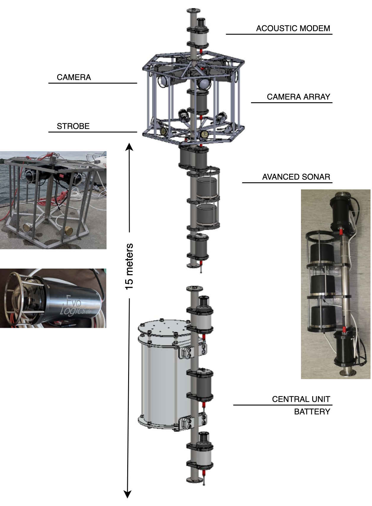
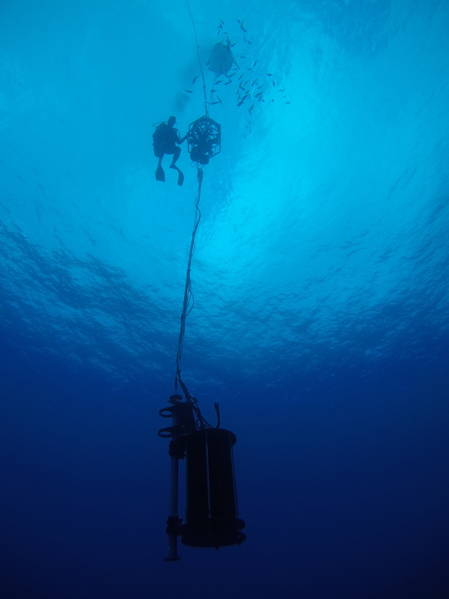
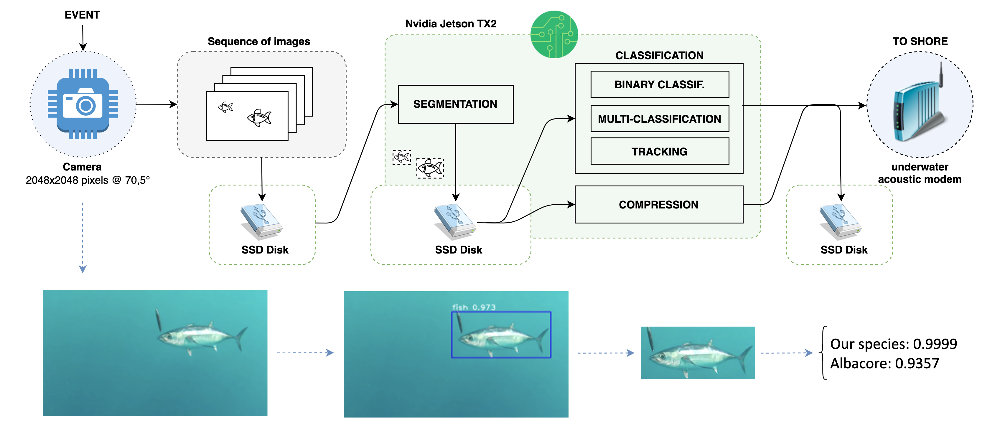
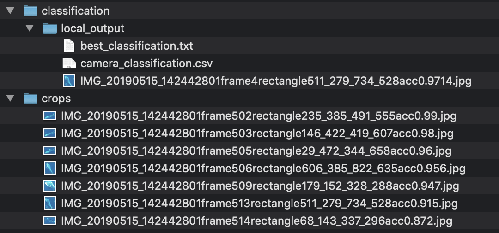
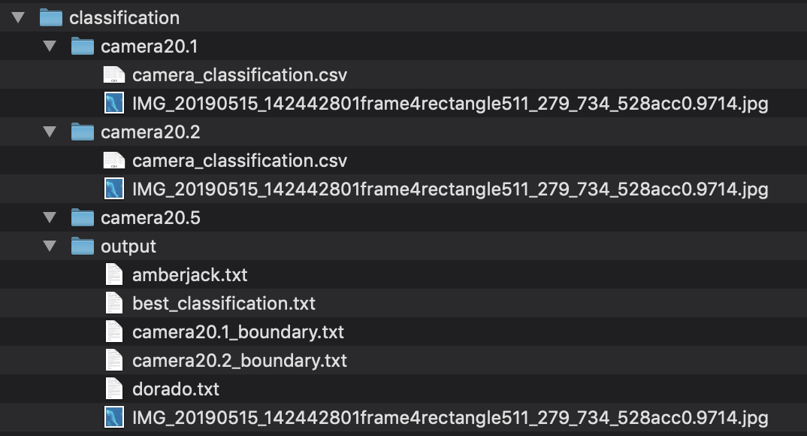
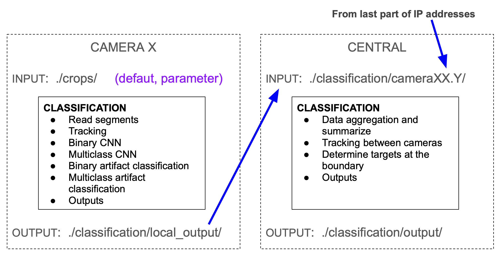

# 

Repository for the Symbiosis project - Optical classification

Main project webpage: http://symbiosis.networks.imdea.org/

<br>

SYMBIOSIS: A holistic opto-acoustic system for monitoring biodiversities
<br>
Our overarching objective is to develop a prototype of a non-invasive system to monitor coastal and deep waters for fish stock, and to assess the environmental health by monitoring key pelagic fish species.

Video:

<p align="center">
 <a href="http://www.youtube.com/watch?v=YfxSVe5DKhA"  target="_blank">
  
  <br>
  SYMBIOSIS PROJECT: Innovative Autonomous System for Identifying Schools of Fish
 </a>
</p>
<!-- [](http://www.youtube.com/watch?v=YfxSVe5DKhA "SYMBIOSIS PROJECT: Innovative Autonomous System for Identifying Schools of Fish") -->


<br>

The Symbiosis system is an opto-acoustic system whose objective is to detect, track, monitor, and classify the marine fauna. The system is physically divided into the same two parts as the sub-systems: acoustics and optics. And the optic system is composed of two camera arrays of 6 cameras units in a circle, one in the top and other in the bottom of the system, separated 15 meters between them. There is an overlap of 10.5 degrees in the field of view on either side of the cameras. Also there is an advance sonar and a central unit to control the whole system. Each camera unit consists mainly in the camera itself and a nVidia Jetson TX2. These units are responsible of the tracking and first steps of the classification process. The central unit assembles and reinforces the system data to provide a report.

Schematic representation of the acoustic and optical Symbiosis system and its main components
<p align="center">
 
</p>
<!--  -->


Sea trial of the optical Symbiosis system in THEMO bouy, Haifa (Israel)
<p align="center">
 
</p>

<br>


## Optical classification

SYMBIOSIS Optic system pipeline



The optical classification itself is divided in two steps, and both are using convolutional neural networks. The first runs a Deep Learning model for a binary classification. The second step runs a multi-class classifier. We use popular convolutional architectures: [VGG16](https://arxiv.org/abs/1409.1556) (binary classification) and [Francois Chollet’s simple architecture](https://blog.keras.io/building-powerful-image-classification-models-using-very-little-data.html) (multi-class classification). In the final version, we expect to use very small architectures desgined by us.

For tracking, we make use of [SORT](https://github.com/abewley/sort). This library must be placed in the same folder that our code.
> If you deploy the code in a ARM-based system, numba libary is not avaliable for this architecture and you must to remove the improvements it introduces in `sort.py` file, comment `@jit` lines.

> It seems that the latest SORT version removes numba dependencies.


Our final goal is the classification of an object (detected as a fish), which may appear in several frames, into one of seven classes (one class for each the six species of interest, and a seventh class for other species).

The prototype focuses on six high commercial importance species:
  - Albacore tuna (Thunnus alalunga)
  - Dorado (dolphinfish; Coryphaena hippurus)
  - Atlantic mackerel (Scomber scombrus)
  - Mediterranean horse mackerel (Trachurus mediterraneus)
  - Greater amberjack (Seriola dumerili)
  - Swordfish (Xiphias gladius)

<br>

For more details see:
  - Design Structure of SYMBIOSIS: An Opto-Acoustic System for Monitoring Pelagic Fish (https://doi.org/10.1109/OCEANSE.2019.8867440)
  - Underwater Localization via Wideband Direction-of-Arrival Estimation Using Acoustic Arrays of Arbitrary Shape (https://www.mdpi.com/1424-8220/20/14/3862)
  - Very Small Neural Networks for Optical Classification of Fish Images and Videos
( paper pre-accepted in IEEE OCEANS 2020. The URL will be updated here when available )
  - More publications: http://symbiosis.networks.imdea.org/publications

<br>

## Usage

This code version is delivered as module to facilitate integration. We provide simple functions to run the classification and generate a final report.

There is other code version (git branch) as *command line interface* version (*CLI*). This version provides the best classified segment instead of the best segmented segment.


### Script for camera units

First you must import the module and its configuration file.
```python
from mod_local_classification import *
from mod_conf import *
```

Then, initialize and load the models.
```python
# CREATE MODELS
cc_models = ClassifModels()

# LOAD MODELS
loadClassificationModels(cc_models)
```

Once you have loaded the models in memory, you can run the classification any time you need with `localClassification` function.
```python
# RUN CLASSIFICATION
localClassification(models=cc_models, input_path='./crops/', debug=False)
```

Function `localClassification`
```python
localClassification(models, input_path, debug)

Paramenters:
        ‘input_path’, optional parameter to provide segments to classify location from the previous fish detection stage. Default: ‘./crops/’.
        ‘debug’, optional parameter for debugging. False by default.

```
> The results are overwritten each time the script runs.


Examples
```python
# Main function (examples):
localClassification()

localClassification('./crops/', True)

localClassification(input_path='./segments_20200723-1715/')
```


<br>

Input:
Folder with crops/segments of the detected fishes from previous stage.

Expected file name format (allowing variations in datetime part, at the beginning):
```
[IMG_]YYYYMMDD_HHMMSSmmmframeZrectangleX1_Y1_X2_Y2accW.WWWWWW.jpg
[IMG_]YYYYMMDD-HHMMSSmmmframeZrectangleX1_Y1_X2_Y2accW.WWWWWW.jpg
[IMG_]YYYYMMDD_HHMMSS_mmmmmmframeZrectangleX1_Y1_X2_Y2accW.WWWWWW.jpg
```
> Note: this format contains needed information to feed the classification process: timestamp (filename base, unique and common for the sequence) + frame number + object location (coordinates) + detection accurary (as a fish in the previous step).

Examples
```
IMG_20190513_143642001frame5rectangle761_849_1016_989acc0.970106.jpg
IMG_20190513-143642001frame5rectangle761_849_1016_989acc0.970106.jpg
20190513_143642_001001frame5rectangle761_849_1016_989acc0.970106.jpg
```

Output path:
./classification/local_output/

Output files:
| file | description |
|--|--|
| `camera_classification.csv` | This file contains all the information needed to create a final report in the central unit: detection accuracy, position (coordinates), tracking information, binary and multi-class accuracies, grouped by tracking accuracies and species decision. |
| `best_detection.txt` | One file with the best segment. It contains the file name to the segment + fish type estimation (species index) + accuray. |
| `'best_segmented_segment'.jpg` | This segment is best segmented for a particular camera unit. |

<br>

Example `best_detection.txt` (content):
```
filename,species,acc
20180123-142707_268abfe571-frame513rectangle511_279_734_528acc0.97.jpg,3,0.9831473231315613
```
Example `'best_classified_segment'.jpg` (filename):
```
20180123-142707_268abfe571-frame513rectangle511_279_734_528acc0.97.jpg
```


Example - folder structure for camera unit:

<p align="center">
 
</p>
<!--  -->


> In some parts of the code, you can find commented code snippets if you need to create your own debugging, for example, to visual inspect the tracking.

<br>

### Script for central unit 

Just import the module and run the classification to generate the report.
```python
from mod_central_classification import *

# RUN CLASSIFICATION
centralClassification(cameras_element='guess', input_path='./classification/', debug=False)
```

Function `centralClassification`

```python
centralClassification(cameras_element, input_path, debug)

Paramenters:
    ‘cameras_element’, optional parameter to indicate which camera array to process. Options: top, bottom, guess.
    By default, the script try to process the files from the top array of cameras (and stop). If it is not available any file from that camaras array, it will try to process the bottom cameras array.
    
    ‘input_path’ , optional parameter to indicate the folder with the cameras' outputs. Default: './classification/'.
    ‘debug’ , optional parameter for debugging. False by default.
```
> Note: it can not process the two arrays at once, the results would be overwritten.

Examples
```python
centralClassification()

centralClassification('guess')

centralClassification(cameras_element='bottom', './classification/', True)

centralClassification(input_path='./classification_20200723-1715/')

```

<br>

Input: Sub folders (with particular name format) for each camera with files processed in each camera board.

Expected camera name folder: 
```
[ input_path ]/cameraXX.Y/
```
> XX.Y correspond to the last two IP number of each camera. The first of those indicates the camera array.

Examples
```
./classification_20200723-1715/camera20.5/
./classification_20200723-1715/camera40.1/
```

<br>

Output path:
[ input_path ]/output/

Example
```
./classification_20200723-1715/output/
```

<br>

Output files:
| file | description |
|--|--|
| `'species'.txt` | One file for each of the 6 species, that contains the number of fishes found of that species (all cameras, array). See the example below. |
| `best_detection.txt` | One file with the best segment for the cameras array. It contains the file name to the segment + accuray  + the fish type estimation (short name + species index). |
| `'best_segmented_segment'.jpg` | The best segmented segment for the cameras array. |
| `cameraXX.Y_boundary.txt` | One file for each camera following the filename format explained above. It contains camera + time of measurement + coordinates of segment + species (short name + index) (each detection in one line). **NEW:** The filename includes the absolute path. The path will be slightly different for each camera. |

<br>


Example `'species'.txt`:
```
filename: dorado.txt
content:  8
```
> Short species classification name: albacore, amberjack, atl_mackerel, dorado, med_mackerel, swordfish.
<br>

Example `best_classification.txt` (content):
```
20180123_142707_001001frame513rectangle511_279_734_528acc0.97.jpg,0.9828381538391112,dorado,3
```

Example `'best_classified_segment'.jpg` (filename):
```
20180123-142707_268abfe571-frame513rectangle511_279_734_528acc0.97.jpg
```
<br>

Example `cameraXX.Y_boundary.txt`:
```
camera20.1_boundary.txt
```

Example `cameraXX.Y_boundary.txt` (content):
```
1,/path/to/camera/folder/20180123-142707_268abfe571-frame499rectangle861_480_1053_612acc0.97.jpg,861,480,1053,612,dorado,3
1,/path/to/camera/folder/20180123-142707_268abfe571-frame504rectangle83_446_380_639acc0.96.jpg,83,446,380,639,amberjack,1
```

<br>

Example - folder structure for  central unit:

<p align="center">
 
</p>
<!--  -->


<br>

### Data integration - cameras and central units

The cameras arrays are connected in net and the partial outputs need to be transfered to the central unit to be processed.

<p align="center">
 
</p>
<!--  -->


## Installation

### Frameworks and libraries for camera units:
- Tensorflow >= 1.10
- Keras >= 2.2
- SORT https://github.com/abewley/sort
- scikit-learn
- scikit-image
- numpy
- scipy
- filterpy (if installed with Anaconda, it is available in ‘conda-forge’)
- numba   (optional, if not, check that is skipped in `sort.py` library. Not available for ARM)
- pandas
- shutil

### Libraries for central unit:
- scikit-learn
- scikit-image
- numpy
- scipy
- filterpy (if installed with Anaconda, it is available in ‘conda-forge’)
- numba   (optional, if not, check that is skipped in ‘sort.py’ library. Not available for ARM)
- pandas
- shutil


<p align="center">
 :fish:
</p>
